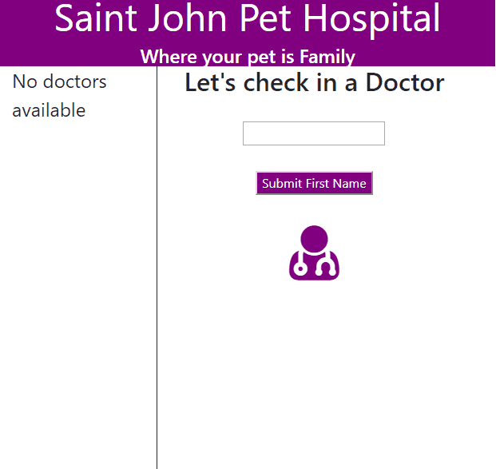
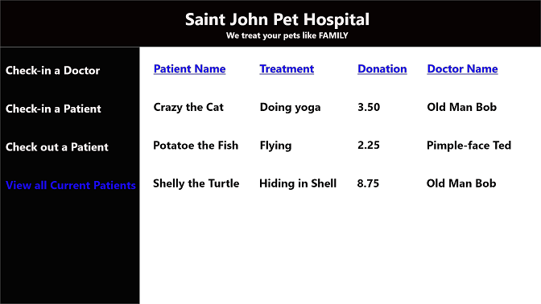

# Saint John Pet Hospital

### Table of Contents

1. Purpose
2. Motivation
3. Wireframe
4. Objectives
5. Technologies Used

### Purpose:

A animal hospital management web application.

### Motivation:

The goal was to practice using Java's object oriented programming concepts and data structures to build a application. This was combined with Spring Boot and ThymeLeaf frameworks to transform it into a MVC based web app.

### WireFrame

### Objectives:

- The user can "check-in" doctors to work at the hospital
- The user can "check-in" pets as patients into the hospital. This requires the pet's name, ailment, donation amount, and choice of doctor.
- The user can "check-out" the pet (patient).
- The user can view all pets getting treated at the hospital
- The user can view all pets being treated by doctor.

### This app was built with the following technologies and tools:

**Java:** Computer programming language

**HTML:** Mark-up language for creating web pages

**CSS:** A formatting language for styling web pages

**Spring Boot:** Java framework based on the MVC architecture application design pattern.

**ThymeLeaf** Java template engine framework

**Git-Hub:** Web-based version control repository and Internet hosting service

**Abode XD** A wire-framing tool used to create a mockup/visual of what is to be coded

_Create by JC Smiley in June of 2019_
